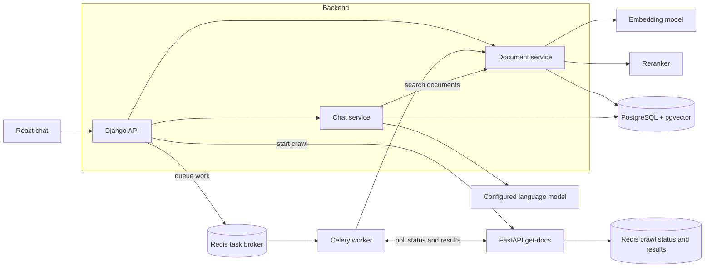
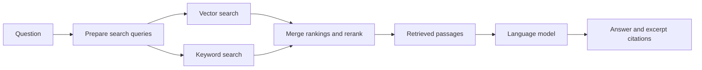
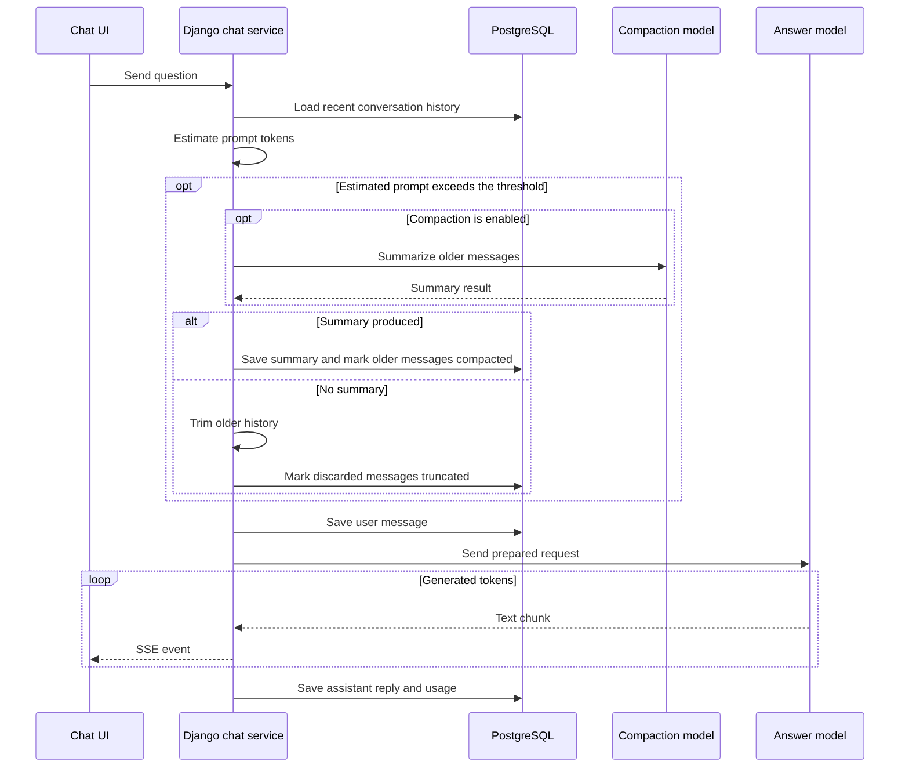

# RAG Chatbot

A chat app for exploring technical documentation. Import a framework’s documentation site or GitHub repository, add your own files or notes, and ask questions across the sources you choose.

## How the pieces fit



Django handles accounts, documents, and chat, and starts crawls through the FastAPI `get-docs` service. Celery polls crawl jobs and processes documents in the background. PostgreSQL stores documents, chat history, keyword indexes, and vector embeddings. One Redis instance carries Celery tasks; a separate Redis instance holds temporary crawl status and results for `get-docs`.

## Importing technical documentation

For a website, `get-docs` looks for `llms-full.txt` or `llms.txt`, then tries the site’s sitemap, and finally follows links within the documentation site. It checks `robots.txt` rules and content signals, and converts HTML pages to Markdown. For a GitHub repository, it collects documentation files.

The Celery worker combines fetched pages into one document, splits it into searchable sections, and stores their embeddings and keyword indexes in PostgreSQL. Each non-empty page’s URL appears in the combined Markdown and in the document’s page metadata.

## Finding answers

For questions using document search, the backend prepares English and Polish search queries, then runs vector and keyword searches concurrently. It merges the rankings and reranks candidates. The configured language model receives the question and retrieved passages. Citation chips pair the answer with the retrieved document names and excerpts.



## Conversation history

Conversations and messages are stored in PostgreSQL. For a standard chat turn, Django builds the provider request from recent history and estimates its size against a configured token budget. When the prompt exceeds the compaction threshold, it summarizes older messages if enabled, or trims older history if compaction is off or produces no summary. Replies stream to the chat as Server-Sent Events (SSE).



Side-by-side mode generates one answer with document search and one without, preparing and trimming history separately for each as needed.

For local llama.cpp, Django checks which models are loaded so the model picker can list them, and reads the context limit to cap prompt size. It caches both results for five minutes to avoid repeated lookups against the local server.

## Run locally

You need Docker Compose and a language model provider. Add its API key in the app’s settings, or configure a local provider.

1. Create `backend/.env` from the example.

   Windows PowerShell:

   ```powershell
   Copy-Item backend/.env.example backend/.env
   ```

   macOS or Linux:

   ```sh
   cp backend/.env.example backend/.env
   ```

2. Replace the example `SECRET_KEY` and `FERNET_KEYS` values with your own. The `.env.example` includes a command to generate a Fernet key. Keep that key for future runs; it encrypts provider API keys saved in the app.

3. Set up Text Embeddings Inference (TEI) for embeddings and reranking. Follow the platform notes in [backend/docker-compose.yml](backend/docker-compose.yml) and the endpoint settings in [backend/.env.example](backend/.env.example).

From the project root, start the app:

**Windows/Linux with NVIDIA models in Docker:** select a compatible TEI image as described in Compose, then run:

```sh
docker compose --profile nvidia up --build
```

**macOS with local TEI, or other hardware using external TEI services:** start both models and set their URLs in `backend/.env`, then run:

```sh
docker compose up --build
```

Open the chat at [http://localhost:5173](http://localhost:5173).
